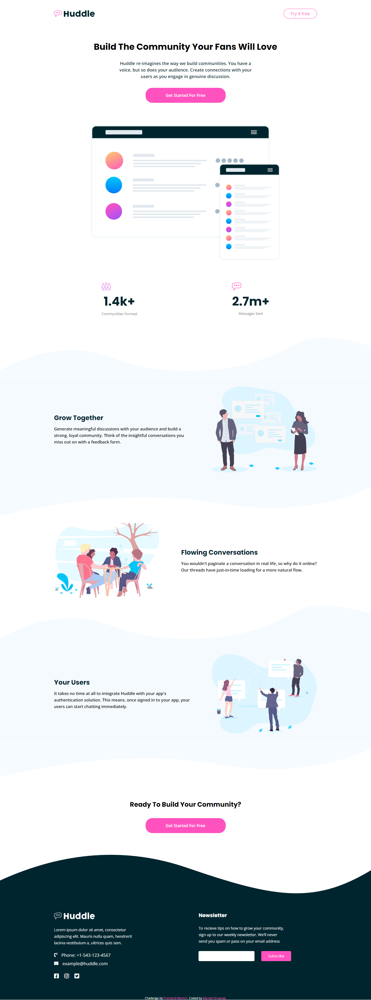

# Frontend Mentor - Fylo dark theme landing page solution

This is a solution to the [Huddle landing page with curved sections challenge on Frontend Mentor](https://www.frontendmentor.io/challenges/huddle-landing-page-with-curved-sections-5ca5ecd01e82137ec91a50f2). Frontend Mentor challenges help you improve your coding skills by building realistic projects.

## Table of contents

    -   [The challenge](#the-challenge)
    -   [Screenshot](#screenshot)

    -   [Built with](#built-with)

-   [Author](#author)

### The challenge

Users should be able to:

-   View the optimal layout for the site depending on their device's screen size
-   See hover states for all interactive elements on the page

### Screenshot

### Built with

-   Semantic HTML5 markup
-   CSS custom properties
-   Flexbox
-   SASS

## Author

-   Website - [Mariam El-sarag](https://mariamtarek514.github.io/profile/)
-   Frontend Mentor - [@Mariamtarek514](https://www.frontendmentor.io/profile/Mariamtarek514)

ely.\*\*
